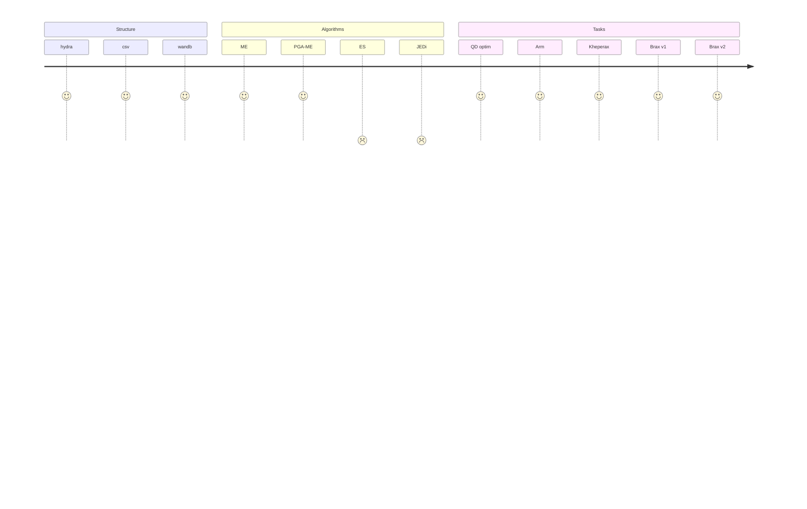

# QDax Benchmark

## Install

```bash
python -m venv .venv
source .venv/bin/activate
pip install --upgrade pip
pip install -r requirements.txt
```

## Run

```bash
python main.py algo=jedi task=kh_standard
```  

## Features

### Tasks

- **QD optim**: Standard Black-Box optimization tasks, with QD descriptors using random projections ([Source](https://github.com/maxencefaldor/learned-qd/blob/main/learned_qd/tasks/bbob_fn.py))
- **Arm**: A simple 2D arm task
- **Kheperax**: 2D mazes using [Kheperax](https://github.com/adaptive-intelligent-robotics/Kheperax)
- **Brax**: Robotics tasks using [Brax](https://github.com/google/brax)

### Algorithms

- **ME**: MAP-Elites 
- **PGA-ME**: Policy-Gradient Assisted MAP-Elites 

## Development Status



